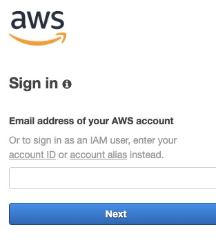

=================
Setup
=================

In this activity you will:

- Log into the AWS portal
- Install Terraform on your endpoint or connect to a linux VM
- Clone the lab software repository

.. warning:: Before you start it is recommended that you launch a private instance
          of your web browser.  This will prevent the use of cached Google or
          Amazon credentials if you log into the AWS consoles.  This
          will help ensure you do not incur any personal charges within these
          cloud providers.

.. figure:: incognito.png

    Chrome Incognito mode

Log into the AWS console
----------------------------

Navigate to the `AWS URL <https://console.aws.amazon.com/>`_ in your
web browser.

``https://console.aws.amazon.com/``

Log in with your AWS credentials (Ask to your speaker). You
must use your corporate email address for the username.

Log into the Linux VM
----------------------------

During this lab we create a VM for the different group on Azure. 
We have already installed the terraform but just in case you need to install on your laptop:

download the zip file 
``https://releases.hashicorp.com/terraform/0.11.14/``

.. code-block:: bash

    $ sudo apt-get install unzip
    $ unzip [Your terraform file in version 0.11.xx]
    $ sudo cp terraform /usr/bin/
    
Now you can verify the version :

.. code-block:: bash

    $ terraform --version

Launch the lab environment
--------------------------
Confirm that the region in EC2 is *"Empty"*
Upper right you can select different region.
Your speaker can ask you to use a different region, 
please look the team organization.

.. figure:: aws-main-region.png

You will be presented with only one lab environments at the moment for AWS.
And you can use your own AWS account if you want to, the price is not high for this lab.

.. note:: We advise to use your own AWS account to replay the lab with your customer or partner.

Each lab environment will take a few minutes to provision due to AWS VPN site 2 site (average 10 minutes).

Palo Alto Networks Access
-------------------------
Once the lab environment has completed the provisioning process and the
**NGFW IP** field is displayed, you may HTTPS/SSH into that IP address using the
following credentials.

- **Username:** ``paloalto``
- **Password:** ``Pal0Alt0@123``

Clone the lab software repository
---------------------------------
Once you have successfully install Git / Terraform / Ansible you will need to clone
the GitHub repository used in this lab.  This repository (or *repo*) contains
the files needed to deploy the network and compute infrastructure we'll be
working with.

.. code-block:: bash

    $ git clone https://github.com/damray/hacklab.git

You are now ready to deploy the lab infrastructure.

